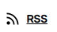

# drpodcast


## Introduction
This is a tool when you want to listen to DR podcasts offline. 
The idea is to be able to download the podcasts as mp3 files and then use them offline.

## Overview
A Python script to download podcast from dr.dk

## Description
This script will parse the RSS link from dr.com and download the podcast as mp3 files.
Go to https://www.dr.dk/lyd/programmer to find a podcast,
then copy link from the RSS feed and use this as argument --url for the script.
The script will create a directory with the name of the podcast serie and add all the mp3 file in that directory.
The mp3 will be prefixed with the date of the publication.

## Installation

### Install
Clone the repo

```
git clone git@github.com:MichaelMichaelsen/drpodcast.git
```
Ensure that all the needed Python packages are installed

```
pip install -r requirements.txt
```

## Usage
```
python drpodcast.py --url https://api.dr.dk/podcasts/v1/feeds/tabloid-3

```
### Url from DR podcasts
This can be extracted https://www.dr.dk/lyd/programmer in the overview page for each podcast.

 On the RSS icon, just right click, select copy link and use that link as argument for the script.

### Typical output
```
$ python drpodcast.py --url https://api.dr.dk/podcasts/v1/feeds/lyssky
Podcast title Lyssky
[generic] 95b5865a69c7a45df1a71eee076356360d1b4932ad80936297150974f1aa65f6: Requesting header
[redirect] Following redirect to https://drod23l.akamaized.net/all/clear/none/00/667ef54055d54c3ad4aeb500/11802465011/download/Lyssky--Livstid_DRLYD-20220900_AudioMain_192.mp3
[generic] Lyssky--Livstid_DRLYD-20220900_AudioMain_192: Requesting header
[info] Lyssky--Livstid_DRLYD-20220900_AudioMain_192: Downloading 1 format(s): mpeg
[download] Destination: ./podcasts/Lyssky/2024-06-28 Livstid.mp3
[download] 100% of 28.25MiB in 00:22
--------------------------------------------------
[generic] c604ae9a969b98f5efeb4bc9f8d9fc098b18f804f4bab687df29f5cf66405986: Requesting header
[redirect] Following redirect to https://drod20l.akamaized.net/all/clear/none/3d/667464a27689f9300c6f343d/11802465010/download/Lyssky--Monster_DRLYD-20220900_AudioMain_192.mp3
[generic] Lyssky--Monster_DRLYD-20220900_AudioMain_192: Requesting header
[info] Lyssky--Monster_DRLYD-20220900_AudioMain_192: Downloading 1 format(s): mpeg
[download] Destination: ./podcasts/Lyssky/2024-06-21 Monster eller ej.mp3
[download] 100% of 42.17MiB in 00:32
--------------------------------------------------
[generic] 5624ce87ada552db787e4c011242111dda78775f8367972509f0c37fe8657c4a: Requesting header
[redirect] Following redirect to https://drod21p.akamaized.net/all/clear/none/c7/667c3c3955d54c3ad4aeb3c7/11802465009/download/Lyssky--Morder-_DRLYD-20220900_AudioMain_192.mp3
[generic] Lyssky--Morder-_DRLYD-20220900_AudioMain_192: Requesting header
[info] Lyssky--Morder-_DRLYD-20220900_AudioMain_192: Downloading 1 format(s): mpeg
[download] Destination: ./podcasts/Lyssky/2024-06-14 Morder fældet af hemmelig agent.mp3
[download] 100% of 35.21MiB in 00:28
--------------------------------------------------

```
The script will create a subdirectory named podcasts and for each podcast group create a directory in the directory podcast.
If a podcast already has been downloaded it will not be downloaded again.

## Todo
* Introduce a list of podcast to select.
* Make a Windows binary of the tool


### DR podcast
Currently I have found the following podcasts

* https://api.dr.dk/podcasts/v1/feeds/stjerner-og-striber-podcast
* https://api.dr.dk/podcasts/v1/feeds/prompt
* https://api.dr.dk/podcasts/v1/feeds/guld-og-groenne-skove
* https://api.dr.dk/podcasts/v1/feeds/djaevlen-i-detaljen
* https://api.dr.dk/podcasts/v1/feeds/tabloid-3
* https://api.dr.dk/podcasts/v1/feeds/foelg-pengene
* https://api.dr.dk/podcasts/v1/feeds/kampen-om-historien-3
* https://api.dr.dk/podcasts/v1/feeds/genstart
